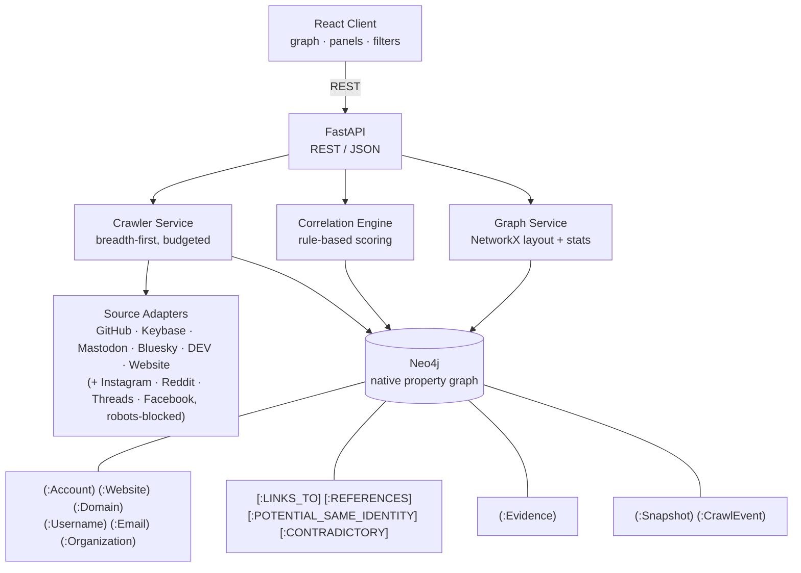
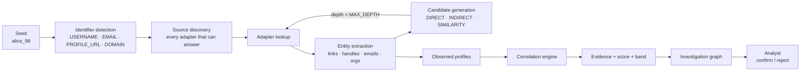
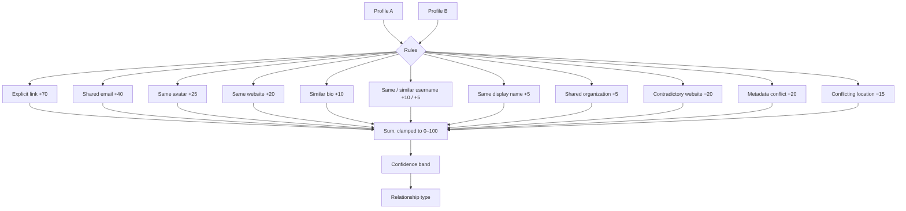
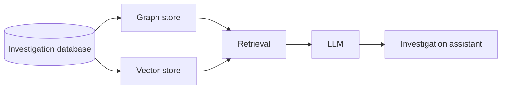

# Omnicient

> **Trace public identities. Follow the evidence.**

Omnicient is an **evidence-backed OSINT crawling and identity correlation
platform**. It starts from a single publicly observable identifier, discovers
other publicly observable entities and relationships, scores potential
associations with a transparent rule-based model, and presents the whole
investigation as an interactive graph an analyst can interrogate, confirm or
reject.

The central principle:

```
Don't claim the identity.
Show the evidence.
```

Omnicient never states that two accounts belong to the same person. It reports
*potential associations* — with the observations behind them, the points each
observation contributed, and the contradictions that argue against them.

---

## Table of contents

- [Problem statement](#problem-statement)
- [Features](#features)
- [Architecture](#architecture)
- [Technology stack](#technology-stack)
- [Installation](#installation)
- [Running the application](#running-the-application)
- [Environment variables](#environment-variables)
- [Demo mode](#demo-mode)
- [API documentation](#api-documentation)
- [Identifier detection](#identifier-detection)
- [Analysis layer](#analysis-layer)
- [Correlation methodology](#correlation-methodology)
- [Confidence scoring](#confidence-scoring)
- [Crawler behaviour and limitations](#crawler-behaviour-and-limitations)
- [Security protections](#security-protections)
- [Ethical and legal considerations](#ethical-and-legal-considerations)
- [Project structure](#project-structure)
- [Testing](#testing)
- [Working in a two-person team](#working-in-a-two-person-team)
- [Future architecture](#future-architecture)
- [License](#license)

---

## Problem statement

Given a known public account — say `Instagram: @alice_98` — an analyst wants to
know which other publicly observable entities are plausibly connected to it,
and *why*.

The usernames rarely match. The connection usually runs through something else:

```
Instagram @alice_98
        │ bio links to
        ▼
     alice.dev
      ╱   │   ╲
     ▼    ▼    ▼
 GitHub Threads Reddit
```

A username search engine answers "does this handle exist elsewhere?", which is
the wrong question — handles are reused by unrelated people all the time.
Omnicient answers a different one: **what publicly observable evidence connects
these entities, and how strong is it?**

That is why the pipeline is split into distinct stages, with the analyst — not
the tool — making the final call:

```
DISCOVERY → ENTITY EXTRACTION → CANDIDATE GENERATION
          → CORRELATION → EVIDENCE → INVESTIGATION GRAPH → ANALYST
```

---

## Features

**Investigation**

- Create an investigation from **one** input — username, email address,
  profile URL or domain — with **no platform to choose**: the identifier type
  is detected and every source that can answer is searched
- Controlled breadth-first crawl of permitted public sources
- Entity extraction, candidate generation and correlation in one run
- Persisted timeline of every crawl event, including source failures
- Re-runnable discovery that preserves analyst decisions
- JSON and CSV export, including analyst decisions and snapshots
- **Identity Intelligence Profile** — an evidence-backed summary of everything
  observed, computed from the graph rather than stored beside it
- **Alias detection** — named, deterministic handle transformations, resistant
  to the `alex`/`alexander` class of false positive
- **Relationship path explorer** — bounded Cypher traversal answering "how are
  these two connected?", ranked deterministically and highlighted in the graph
- **Investigation leads** — deterministic pivots derived from stored evidence,
  banded HIGH / MEDIUM / LOW

**Evidence and correlation**

- Ten evidence types, including negative (contradictory) evidence
- Transparent additive scoring with configurable point values
- Four confidence bands, never presented as probabilities
- Every point traceable to an evidence row with the URL it came from
- "Insufficient evidence" is a first-class, common outcome

**Interface**

- Dark, dense investigation console
- Interactive React Flow graph with zoom, pan, drag, fit, reset layout
- Entity, relationship and evidence panels
- Filters for entity type, relationship type, confidence band and score
- Focus mode (expand/collapse an entity's connections)
- Analyst confirm / reject / undo workflow

**Sources**

- **Six sources that work live**, chosen because their robots.txt permits
  anonymous lookups: GitHub, Keybase, Mastodon, Bluesky, DEV and websites
- Instagram, Reddit, Threads and Facebook adapters, which report their refusal
  rather than working around it
- Platform-aware URL parsing for X, LinkedIn, YouTube and Hacker News —
  discovered as candidate entities before adapters exist for them
- Adapter interface designed so a new platform is one new class

---

## Architecture



The investigation pipeline:



**Separation of concerns.** The crawler *finds* information. The correlation
engine *evaluates* relationships. The graph service *shapes* them for display.
The frontend *renders* them. The analyst *decides*. The frontend never learns
how crawling works — it consumes entities, relationships, evidence and a graph.

---

## Technology stack

| Layer     | Choice                                                              |
| --------- | ------------------------------------------------------------------- |
| Backend   | Python 3.12+, FastAPI, Pydantic v2, Neo4j 5 (official driver)        |
| Crawling  | httpx (async), BeautifulSoup4, lxml                                  |
| Graph     | NetworkX (processing), React Flow (visualisation)                    |
| Frontend  | React 18, TypeScript, Vite, Tailwind CSS v4, `@xyflow/react`         |
| Testing   | pytest, pytest-asyncio, Ruff                                         |

No Kubernetes, Kafka, Redis, Celery, Elasticsearch or microservices. The MVP
is a single API process, one Neo4j instance and a static frontend —
deliberately. The seams that would let those be introduced later are described
under [Future architecture](#future-architecture).

**Why Neo4j.** An investigation *is* a graph, so storing it as one removes a
translation layer: the nodes an analyst sees in the interface are the nodes on
disk. "Which accounts are two hops from this website?" is a query rather than a
join plan, and the relationship types in the data model
(`POTENTIAL_SAME_IDENTITY`, `SHARED_WEBSITE`, `CONTRADICTORY`) are the real
edge types in the database, not rows in a table that describe edges.

---

## Installation

Requirements: **Python 3.12+**, **Node.js 20+**, and a **Neo4j 5** instance.

```bash
git clone <repository>
cd omnicient
```

### Neo4j

The quickest option is the container, which is also what
`docker compose up` runs:

```bash
docker run -d --name omnicient-neo4j \
  -p 7474:7474 -p 7687:7687 \
  -e NEO4J_AUTH=neo4j/<choose-a-password> \
  neo4j:5.26-community
```

Neo4j Desktop or a package install works equally well; Omnicient only needs a
Bolt endpoint and credentials. The browser at <http://localhost:7474> is useful
for inspecting an investigation graph directly in Cypher.

### Backend

```bash
cd backend
python -m venv .venv
source .venv/bin/activate          # Windows: .venv\Scripts\activate
pip install -r requirements.txt
cp .env.example .env               # then set NEO4J_PASSWORD
```

`NEO4J_PASSWORD` is the only value without a working default — no password is
hardcoded anywhere in the repository.

### Frontend

```bash
cd frontend
npm install
```

---

## Running the application

Two terminals:

```bash
# Terminal 1 — API on http://127.0.0.1:8000
cd backend
source .venv/bin/activate
uvicorn app.main:app --reload
```

```bash
# Terminal 2 — interface on http://localhost:5173
cd frontend
npm run dev
```

Open <http://localhost:5173>, enter `@alice_98`, and press **Start
investigation**. Demo mode is on by default, so this works with no network
access and no credentials of any kind.

**Schema setup is automatic.** On startup the API waits for Neo4j (retrying,
since a container is often still recovering), then applies its constraints and
indexes. Every statement is `IF NOT EXISTS`, so it is safe on every boot and
there is no migration step. If Neo4j never answers, the API still starts and
`GET /api/health` reports `status: degraded` with `database.connected: false`
rather than the process dying silently.

### Docker

```bash
cp .env.example .env      # set NEO4J_PASSWORD
docker compose up --build
# interface:     http://localhost:5173
# API docs:      http://localhost:8000/docs
# Neo4j browser: http://localhost:7474
```

Compose starts Neo4j first and holds the backend until Bolt actually answers a
query, so first boot works without a retry.

---

## Environment variables

All are optional except `NEO4J_PASSWORD`; see `backend/.env.example`.

| Variable                            | Default                      | Purpose                                                |
| ----------------------------------- | ---------------------------- | ------------------------------------------------------ |
| `NEO4J_URI`                         | `bolt://localhost:7687`      | Bolt endpoint                                          |
| `NEO4J_USERNAME`                    | `neo4j`                      | Neo4j user                                             |
| `NEO4J_PASSWORD`                    | *(required)*                 | Neo4j password — never hardcoded                       |
| `NEO4J_DATABASE`                    | `neo4j`                      | Target database inside the DBMS                        |
| `NEO4J_STARTUP_TIMEOUT`             | `30`                         | Seconds to wait for Neo4j at boot                      |
| `OMNICIENT_DEMO_MODE`               | `true`                       | Use the offline synthetic dataset                      |
| `OMNICIENT_MAX_DEPTH`               | `2`                          | Maximum crawl depth from the seed                      |
| `OMNICIENT_MAX_PAGES`               | `50`                         | Page budget for one investigation                      |
| `OMNICIENT_REQUEST_TIMEOUT`         | `10`                         | Per-request timeout, seconds                           |
| `OMNICIENT_REQUEST_DELAY`           | `1.0`                        | Minimum delay between requests to one host             |
| `OMNICIENT_MAX_RESPONSE_BYTES`      | `2000000`                    | Response size limit                                    |
| `OMNICIENT_MAX_REDIRECTS`           | `3`                          | Redirect hops, each re-validated                       |
| `OMNICIENT_RESPECT_ROBOTS`          | `true`                       | Honour `robots.txt` where available                    |
| `OMNICIENT_ALLOW_PRIVATE_NETWORKS`  | `false`                      | **Disables the SSRF guard.** Isolated test networks only |
| `OMNICIENT_USER_AGENT`              | `Omnicient/0.1 …`            | Identifying User-Agent                                 |
| `OMNICIENT_CORS_ORIGINS`            | `http://localhost:5173,…`    | Allowed browser origins                                |
| `OMNICIENT_LOG_LEVEL`               | `INFO`                       | Log level                                              |

---

## Demo mode

Demo mode is mandatory to the design: Omnicient must demonstrate the entire
pipeline without contacting any external service. It ships a synthetic dataset
built to exercise every class of evidence.

| Entity                        | Role in the demonstration                                   |
| ----------------------------- | ----------------------------------------------------------- |
| Instagram `@alice_98`         | Seed; links to Threads, the website, and a private profile   |
| Threads `@alice_dev`          | Explicitly linked — strongest possible evidence              |
| Website `alice.dev`           | The pivot: links to GitHub, Reddit, Threads, Instagram, Facebook |
| GitHub `@alice-security`      | Same avatar, same website, similar bio → **HIGH**            |
| Reddit `@alice_security`      | Shares the website only → **MEDIUM**                         |
| Facebook `Alice Example`      | Shares the website and display name → **MEDIUM**             |
| Facebook `alice.private`      | Cannot be read publicly → demonstrates graceful failure      |
| X `@alice98`                  | Similar handle, **different website, conflicting location** → contradictory |
| `alice@alice.dev`, `Contoso Labs` | Email and organization pivots                           |

Everything in it is fictional and every entity carries a **`DEMO DATA`** badge
in the interface and a `notice` field in the API. It describes no real person.

Switching demo mode off (per investigation, or with `OMNICIENT_DEMO_MODE=false`)
makes the same pipeline query live public pages. Platforms that require a login
are reported as unavailable rather than worked around.

---

## API documentation

FastAPI publishes interactive OpenAPI docs at <http://localhost:8000/docs>.

| Method   | Path                                        | Purpose                                  |
| -------- | ------------------------------------------- | ---------------------------------------- |
| `GET`    | `/api/health`                               | Status, mode, database, sources, bands   |
| `GET`    | `/api/stats`                                | Dashboard totals across investigations   |
| `POST`   | `/api/investigations`                       | Create (and by default start) one        |
| `GET`    | `/api/investigations`                       | List, newest first                       |
| `GET`    | `/api/investigations/{id}`                  | Detail with timeline and source issues   |
| `DELETE` | `/api/investigations/{id}`                  | Delete an investigation and its data     |
| `POST`   | `/api/investigations/{id}/crawl`            | Run discovery + correlation synchronously |
| `GET`    | `/api/investigations/{id}/entities`         | Entities (optional `?type=`)             |
| `GET`    | `/api/investigations/{id}/relationships`    | Relationships (optional `?min_score=`)   |
| `GET`    | `/api/investigations/{id}/graph`            | Nodes, edges, layout hints, statistics   |
| `GET`    | `/api/investigations/{id}/profile`          | Identity Intelligence Profile            |
| `GET`    | `/api/investigations/{id}/aliases`          | Potential aliases, with transformations  |
| `GET`    | `/api/investigations/{id}/paths`            | Ranked routes between two entities       |
| `GET`    | `/api/investigations/{id}/leads`            | Suggested investigation leads            |
| `GET`    | `/api/investigations/{id}/events`           | Crawl timeline                           |
| `GET`    | `/api/investigations/{id}/activity`         | Alias of `/events` (section 27 wording)  |
| `GET`    | `/api/investigations/{id}/evidence`         | All evidence for the investigation       |
| `GET`    | `/api/investigations/{id}/export`           | Export (`?format=json\|csv`, `?download=true`) |
| `GET`    | `/api/entities/{id}`                        | Entity with snapshot history             |
| `GET`    | `/api/entities/{id}/relationships`          | Relationships touching an entity         |
| `GET`    | `/api/entities/{id}/snapshots`              | Observation history for an entity        |
| `GET`    | `/api/relationships/{id}`                   | Relationship with endpoints and evidence |
| `GET`    | `/api/relationships/{id}/evidence`          | Evidence split into support / contradiction |
| `POST`   | `/api/relationships/{id}/confirm`           | Analyst: evidence reviewed and supportive |
| `POST`   | `/api/relationships/{id}/reject`            | Analyst: false positive                  |
| `POST`   | `/api/relationships/{id}/reset`             | Analyst: undo a decision                 |

### The contract between backend and frontend

The backend hands over an investigation graph; the frontend renders it:

```json
{
  "nodes": [{ "id": "…", "type": "ACCOUNT", "platform": "github", "position": { "x": 0, "y": 220 } }],
  "edges": [{ "id": "…", "source": "…", "target": "…", "confidence_score": 65, "evidence_count": 5 }],
  "stats": { "entities": 11, "relationships": 22, "evidence": 45, "contradictions": 2 }
}
```

---

## Identifier detection

Omnicient asks for one thing, and never for a platform:

```
Start Investigation

[ username, email, profile URL, or domain ]

                              [ Investigate ]
```

`app/utils/identifier.py` classifies whatever arrives. Detection is ordered
most-specific first and refuses to guess:

| Input                                | Detected       | Platform    | Searched                        |
| ------------------------------------ | -------------- | ----------- | ------------------------------- |
| `alice_98`                           | `USERNAME`     | *(none)*    | every account source            |
| `alice@example.com`                  | `EMAIL`        | `email`     | public references to the address |
| `https://github.com/alice-security`  | `PROFILE_URL`  | `github`    | that account, then outward      |
| `alice.dev`                          | `DOMAIN`       | `website`   | the site, then what it links to |
| `https://alice.dev/about`            | `WEBSITE_URL`  | `website`   | that page, then what it links to |
| `not a valid identifier`             | *rejected*     | —           | nothing (HTTP 422)              |

A bare username has **no** platform, and that is the point: the seed becomes a
`(:Username)` pivot node and `discover_sources()` fans out to every registered
account adapter. Each source is *asked*; none is assumed to hold the handle,
and a source that returns nothing leaves no node behind — so the graph shows
where the handle actually exists rather than where it might.

A URL with a non-HTTP scheme (`javascript:`, `file:`, `ftp:`) is rejected
outright rather than falling through to be read as a handle, and a known
platform host whose path is not a profile (`instagram.com/p/XYZ`) is treated as
a website, never as an account.

---

## Analysis layer

Four services read the investigation graph without changing it. None of them
stores a second copy: a profile, an alias list, a route or a lead is always a
statement about the graph's *current* state, and a stored one would go stale
the moment an analyst confirmed something.

### Identity Intelligence Profile

`GET /api/investigations/{id}/profile` aggregates what was observed - platforms,
websites, emails, organizations, locations, timeline, statistics - and every
value names the entities that published it, so the interface can navigate back
to the source. Two rules keep it from becoming an identity claim:

* **Attribution, not assertion.** `alice.dev` is not "the subject's website".
  It is a value that six named entities published, with a count to prove it.
* **Rejected means rejected.** An entity reachable only through relationships
  the analyst rejected stops contributing its attributes, so a discarded false
  positive cannot keep shaping the summary from behind the scenes.

Platform hosts are excluded from "public websites": a profile linking to
`github.com` is an *account*, already shown under platforms.

### Alias detection

`app/services/alias_detection.py` separates two questions that are easy to
conflate:

1. **Which deterministic transformation relates these handles?** Case,
   separator substitution/removal/addition, numeric suffix, a known role
   suffix, a shared root token. A *named* transformation is explainable; a
   distance score is not.
2. **Does anything corroborate it?** Shared website, email, avatar,
   organization or display name - evidence the correlation engine already
   collected, reused rather than recomputed.

Resemblance alone is capped well below the confident bands, so an alias cannot
reach HIGH on spelling. The false-positive gate is explicit: `alex`/`alexander`
and `sam`/`samantha` produce **no** transformation, because a shared prefix is
not one. Aliases are stored as their own `POTENTIAL_ALIAS` edge - a narrower
claim than `POTENTIAL_SAME_IDENTITY`, being about the handles rather than the
people.

### Relationship path explorer

`GET /api/investigations/{id}/paths?source_entity_id=…&target_entity_id=…`
runs a bounded, parameterized traversal (`MAX_DEPTH=5`, `MAX_PATHS=5`, both
configurable and hard-capped) scoped to a single investigation. Ranking is
deterministic and stated openly:

* a rejected step sinks a route outright - the analyst already said no
* fewer contradictions beat more
* shorter beats longer; every hop is another inference
* confirmed steps beat unreviewed ones

Evidence counts toward the score **per hop, not in total** — summing rewards
length, which is how a two-hop detour ends up outranking the direct connection
it detours around. Selecting a route highlights exactly its nodes and edges in
React Flow.

### Investigation leads

`GET /api/investigations/{id}/leads` runs nine deterministic rules over the
stored graph — shared website clusters, repeated emails, shared avatars,
potential aliases, unreviewed strong associations, contradictions needing
review, bridge entities, unresolved candidates and shared organizations — and
bands them HIGH / MEDIUM / LOW from one score with two thresholds.

Leads are *suggestions*, never conclusions, and nothing here starts a new
external search: the analyst stays in control. Unreviewed associations are
summarised rather than enumerated, because one lead per relationship is just
the relationship list again.

---

## Correlation methodology

Correlation runs over the *observed profiles* the crawler collected — never
over raw HTML — and compares every pair of account entities. Each rule that
fires produces one evidence row: a type, a human-readable description, the
value it extracted, the URL it came from, and its point contribution.



Design decisions worth knowing:

- **Positive evidence is required.** A pair that only contradicts each other is
  not a relationship and gets no edge; contradictions instead weaken the
  relationships they actually touch.
- **Structural edges are separate.** `LINKS_TO` / `REFERENCES` edges record an
  observed public link (A's bio links to B). Correlation edges
  (`POTENTIAL_SAME_IDENTITY`, `SHARED_WEBSITE`, …) record an inference *about*
  identity. Both can exist between the same pair, and they mean different things.
- **Provenance is preserved.** Every entity records whether it was reached by an
  explicit link (`DIRECT`), through another entity (`INDIRECT`), or generated
  from a handle variant (`SIMILARITY`). A similarity candidate earns nothing by
  existing.
- **Weak signals are labelled weak.** Evidence text for username and display
  name matches says so explicitly, in the analyst's own words, not just numerically.
- **Avatar matching compares normalized image URLs** in the MVP — it catches one
  image reused across platforms, not a re-encoded copy. Perceptual hashing is
  the obvious next step and slots into the same evidence type.

All point values live in one place, `ScoringConfig` in `backend/app/config.py`.

---

## Confidence scoring

| Score    | Band          |
| -------- | ------------- |
| 0–19     | `LOW`         |
| 20–49    | `MEDIUM`      |
| 50–74    | `HIGH`        |
| 75–100   | `VERY HIGH`   |
| no evidence | `INSUFFICIENT` |

**These are not probabilities.** A score of 72 means "the evidence found adds
up to 72 points under the current model" — not "72% likely to be the same
person". The interface always shows the band, the score and the reasons
together, for example:

```
Instagram @alice_98  ↕  GitHub @alice-security
Potential Same Identity · Confidence HIGH · Score 65

Supporting evidence
  ✓ SAME_AVATAR          +25  Both profiles use the same public avatar image
  ✓ SAME_WEBSITE         +20  Both profiles publish the same external website: alice.dev
  ✓ SIMILAR_BIO          +10  Public biographies use substantially the same wording
  ✓ SAME_DISPLAY_NAME     +5  Same public display name ('Alice R.') — weak, many people share a name
  ✓ SHARED_ORGANIZATION   +5  Both profiles reference the organization 'contoso labs'

Contradictions
  None

Analyst status: UNREVIEWED   [Confirm] [Reject]
```

`CONFIRMED` means **an analyst reviewed the evidence and judged it supportive**.
It never asserts real-world identity certainty, and the wording in the UI, the
API and the export all say so.

---

## Crawler behaviour and limitations

The crawler is breadth-first and bounded in every direction: depth
(`MAX_DEPTH=2`), pages (`MAX_PAGES=50`), per-request timeout, response size,
redirect hops, and a polite per-host delay. It follows only URLs discovered
during the investigation, de-duplicates entities by `(type, platform,
identifier)`, and honours `robots.txt` where it is available.

### Which sources work live, and why

Measured, not assumed — each platform's robots.txt was checked against
Omnicient's user agent, and every permitted endpoint was then probed:

| Source | Live? | Endpoint |
| --- | --- | --- |
| GitHub | ✅ | `api.github.com/users/{u}` — documented, anonymous |
| Keybase | ✅ | `keybase.io/_/api/1.0/user/lookup.json` — verified proofs |
| Mastodon | ✅ | `/api/v1/accounts/lookup` on an allow-listed instance |
| Bluesky | ✅ | `public.api.bsky.app` AT Protocol appview |
| DEV | ✅ | `dev.to/api/users/by_username` |
| Websites | ✅ | the page itself, robots permitting |
| Instagram | robots off | `Disallow: /`, but the public profile parses |
| Facebook | robots off | `Disallow: /`, but public pages parse |
| Threads | robots off | `Disallow: /`, but the public profile parses |
| Reddit | ❌ | `Disallow: /` — and HTTP 403 to non-browser clients |
| GitLab, Codeberg, Gravatar, Lobsters | ❌ | `Disallow:` on the API path |

**"robots off"** means the source is reachable only when the operator sets
`OMNICIENT_RESPECT_ROBOTS=false`. Nothing else changes: Omnicient still sends
its own identifying user agent, keeps the per-host delay and the crawl budget,
and does not impersonate a browser's TLS fingerprint, rotate user agents or
proxies, or call private endpoints. robots.txt is an advisory protocol, so
whether to consult it is the operator's call — but these platforms' terms of
service restrict automated collection independently of it, and that judgement
is the operator's too. Reddit is unreachable either way: it answers a
non-browser client with HTTP 403.

The interface shows `robots: ignored` on the dashboard whenever the setting is
off, so an analyst always knows which policy produced the graph they are
reading.

**Keybase is the strongest legitimate pivot in the set.** Its entire purpose is
publishing *verified* links between one person's accounts: the user signs a
statement on each platform and Keybase checks it. One lookup of `keybase/chris`
yields X, GitHub, Reddit and Hacker News handles plus a personal domain — as
`EXPLICIT_LINK` evidence (+70), because the account holder demonstrably
controlled both ends. Omnicient still does not *claim* the identity on that
basis: a proof shows control of accounts, not who the human is, and it can be
stale.

### Instagram, Threads and Facebook cannot be crawled live

This is worth stating up front, because it is the first thing you will hit.
All three publish the same rule:

```
# instagram.com/robots.txt, facebook.com/robots.txt, threads.com/robots.txt
User-agent: *
Disallow: /
```

Omnicient honours `robots.txt`, so a live investigation seeded with an
Instagram handle stops immediately with:

```
instagram:<handle> could not be read: robots.txt at https://instagram.com disallows this path
```

That is the tool working as designed, not a failure. The options are:

1. **Demo mode** (the default) — the full pipeline, offline, on synthetic data.
2. **Seed a domain instead** — just type `alice.dev`; the identifier detector
   does the rest. Personal sites usually permit crawling, and a personal site
   is the strongest pivot in a public-source investigation anyway: it is where
   people list their own accounts. This path works live today and yields
   GitHub, Reddit, X, LinkedIn, Mastodon and Threads accounts, emails and
   organizations.
3. **Seed a GitHub or Reddit handle** — both adapters read the documented
   public JSON those platforms publish for anonymous readers, so they work live
   without any of the problems above.
4. `OMNICIENT_RESPECT_ROBOTS=false` — the operator's call, and their
   responsibility. Be clear about what this does and does not buy you. Measured
   against the live sources:

   | Source | robots respected | robots disabled |
   | --- | --- | --- |
   | GitHub | works | works (robots permits it) |
   | Website | works | works |
   | Instagram | `ROBOTS_DISALLOWED` | a *prominent* public profile parsed |
   | Reddit | `ROBOTS_DISALLOWED` | `BLOCKED` (HTTP 403) |

   So disabling robots does not reliably unlock these platforms. Reddit refuses
   a non-browser client outright, and Instagram's terms separately prohibit
   automated collection whatever robots.txt says. Getting consistently past
   either needs TLS-fingerprint impersonation, rotating user agents, proxy pools
   or undocumented private endpoints — every one of which is out of scope by
   design (section 5). Omnicient reports the refusal and moves on.

**Other known limitations, stated plainly:**

- Only the first page of a website is fetched, and only links to *other* hosts
  become new entities — a site's own internal pages are not identities.
- X, LinkedIn, YouTube and Mastodon are *recognised* (their URLs parse into
  platform + identifier) but have no adapter yet, so they appear as unresolved
  candidate entities in live mode.
- GitHub and Reddit rate limit anonymous clients. Omnicient reports the limit
  and moves on rather than working around it, so a large live investigation may
  see `RATE_LIMITED` on those sources.
- Avatar comparison is URL-based (see above).
- Organization extraction is conservative and worth few points by design.
- A failing source never fails an investigation: the reason is recorded in the
  timeline, surfaced in the sidebar, and the run completes with what it has.

---

## Security protections

Omnicient fetches URLs found inside untrusted content, which makes the crawler
a request-forgery primitive unless it is constrained. It is constrained:

- **SSRF guard** on the initial URL *and every redirect hop*: only `http(s)`,
  no embedded credentials, and hostnames rejected when they are `localhost`,
  `*.local` / `*.internal`, or resolve to loopback, RFC1918, link-local,
  multicast, reserved or cloud-metadata addresses (`169.254.169.254` and
  friends). Every address a hostname resolves to is checked, not just the first.
- **Response size limits** enforced while streaming, so an oversized body is
  abandoned rather than buffered.
- **Timeouts, redirect caps, depth caps and page budgets** on every crawl.
- **Input validation** on seed identifiers and platform names before anything
  is queried.
- **Safe HTML parsing** with lxml through BeautifulSoup; parse failures become
  structured errors instead of exceptions.
- **Structured logging** with automatic redaction of any field whose name looks
  like a credential. Omnicient handles no passwords, tokens, cookies or
  sessions at all.
- **Uniqueness enforced by the database.** Neo4j constraints make an entity
  unique per `(investigation, type, platform, identifier)`, so de-duplication
  cannot drift from what the crawler assumes.
- **No Cypher injection.** Every query is parameterized. The two places Cypher
  cannot take a parameter — node labels and relationship types — are resolved
  through fixed allow-lists derived from the enums.

Tests cover the SSRF guard, the redirect re-validation path and the size limit.

---

## Ethical and legal considerations

Omnicient is intended for:

- authorized OSINT
- cybersecurity research
- academic research
- threat intelligence
- defensive investigations
- digital footprint analysis

Omnicient **does not and will not** implement authentication or authentication
bypass, private-account access, credential harvesting, CAPTCHA bypass,
rate-limit evasion, cookie or session reuse, session hijacking, unauthorized
API access, private-information extraction, or unrestricted mass scraping.
These are not missing features; excluding them is a design commitment.

The tool reports *potential associations* from public data. Attributing a
digital identity to a real person is a consequential act with real
consequences for that person. Omnicient deliberately stops short of it, shows
its evidence, and leaves the judgement — and the responsibility — with the
analyst. Users are responsible for complying with applicable law, platform
terms and data-protection regulation.

---

## Project structure

```
omnicient/
├── backend/
│   ├── app/
│   │   ├── main.py             FastAPI application, CORS, error handlers
│   │   ├── config.py           Settings + ScoringConfig (all point values)
│   │   ├── database.py         Neo4j driver, constraints, indexes
│   │   ├── repository.py       All Cypher: the only module that queries
│   │   ├── demo_data.py        Synthetic dataset and offline adapters
│   │   ├── api/                health, investigations, entities,
│   │   │                       relationships, evidence
│   │   ├── models/             Domain records (plain dataclasses) + enums
│   │   ├── schemas/            Pydantic request/response contract
│   │   │                       (+ profile, alias, path, lead)
│   │   ├── services/           crawler, discovery, correlation,
│   │   │                       alias_detection, identity_profile, paths,
│   │   │                       leads, graph, investigation (orchestration)
│   │   ├── sources/            base + github, keybase, mastodon, bluesky,
│   │   │                       devto, website, instagram, reddit, threads,
│   │   │                       facebook
│   │   └── utils/              identifier, normalization, url_parser,
│   │                           validation, logging
│   ├── tests/                  identifier, normalization, url_parser,
│   │                           correlation, alias_detection,
│   │                           identity_profile, paths, leads, graph,
│   │                           sources, api
│   ├── requirements.txt
│   └── .env.example
├── frontend/
│   ├── src/
│   │   ├── components/         InvestigationGraph, EntityNode, EntityPanel,
│   │   │                       RelationshipPanel, EvidencePanel, Sidebar,
│   │   │                       Filters, SearchBar, ActivityLog,
│   │   │                       IdentityProfilePanel, LeadsPanel,
│   │   │                       PathExplorer, InvestigationHeader
│   │   ├── pages/              Dashboard, Investigation
│   │   ├── api/client.ts       Typed REST client
│   │   ├── types/index.ts      The API contract in TypeScript
│   │   └── lib/display.ts      Shared presentation vocabulary
│   ├── package.json
│   └── vite.config.ts
├── docker-compose.yml
├── README.md
└── LICENSE
```

### Data model

Everything is a node or a relationship in Neo4j:

```
(:Investigation)-[:DISCOVERED]->(:Entity:Account|Website|Domain|Username|Email|Organization)
(:Entity)-[:LINKS_TO|REFERENCES|SHARED_WEBSITE|
           POTENTIAL_SAME_IDENTITY|CONTRADICTORY|...]->(:Entity)
(:Entity)-[:HAS_SNAPSHOT]->(:Snapshot)
(:Investigation)-[:COLLECTED]->(:Evidence)-[:CONCERNS]->(:Entity)
(:Investigation)-[:LOGGED]->(:CrawlEvent)
```

Each entity carries the shared `:Entity` label *and* one for its type, so
`MATCH (a:Account)` works exactly as the data model describes while uniform
traversals stay simple.

**Where evidence lives.** A scored association is a native Neo4j relationship —
that is the whole point of using a graph database. But a Neo4j relationship
cannot itself be the endpoint of another relationship, so the `SUPPORTED_BY`
edge in the conceptual model is realised as an `(:Evidence)` node carrying the
`relationship_id` of the edge it explains, indexed for exactly that lookup.
Every observation behind a score is one indexed query away, and the graph stays
traversable.

Useful queries once an investigation has run:

```cypher
// Every association an analyst confirmed, strongest first
MATCH (a:Entity)-[r:POTENTIAL_SAME_IDENTITY]->(b:Entity)
WHERE r.analyst_status = 'CONFIRMED'
RETURN a.name, b.name, r.confidence_score, r.confidence_level
ORDER BY r.confidence_score DESC;

// The evidence behind one relationship
MATCH (v:Evidence {relationship_id: $id})
RETURN v.type, v.description, v.weight, v.supports, v.source_url
ORDER BY v.weight DESC;

// Accounts reachable from a website, two hops out
MATCH (w:Website {identifier: 'alice.dev'})-[*1..2]-(a:Account)
RETURN DISTINCT a.platform, a.identifier;
```

Entity types: `ACCOUNT`, `WEBSITE`, `DOMAIN`, `USERNAME`, `EMAIL`, `PERSON`,
`ORGANIZATION`. Relationship types: `LINKS_TO`, `REFERENCES`, `USES_USERNAME`,
`SHARED_WEBSITE`, `SHARED_EMAIL`, `SHARED_AVATAR`, `SHARED_ATTRIBUTE`,
`POTENTIAL_SAME_IDENTITY`, `POTENTIAL_ALIAS`, `CONTRADICTORY`. Evidence types: `EXPLICIT_LINK`,
`SAME_WEBSITE`, `SAME_USERNAME`, `SIMILAR_USERNAME`, `SAME_DISPLAY_NAME`,
`SAME_AVATAR`, `SIMILAR_BIO`, `SHARED_EMAIL`, `SHARED_ORGANIZATION`,
`CONTRADICTORY_ATTRIBUTE`, `USERNAME_TRANSFORMATION`, `SHARED_ROOT_TOKEN`.

Every evidence item carries its full provenance — what was observed
(`extracted_value`), the comparison form that actually matched
(`normalized_value`), where (`source_url`, `source_entity_id`), when
(`collected_at`), which entities it connects, and what it did to the score
(`weight`, `stance`). `stance` is `SUPPORTING`, `CONTRADICTORY` or `NEUTRAL`;
neutral covers observations that are recorded provenance but move no score,
such as an alias transformation.

A **snapshot** is written every time an entity is observed. The MVP only stores
them; keeping the history from day one is what makes temporal analysis
possible later without a migration.

---

## Testing

```bash
cd backend
source .venv/bin/activate
pytest              # 269 tests
ruff check .        # lint
```

```bash
cd frontend
npm run typecheck
npm run build
```

The suite covers identifier detection (usernames, emails, profile URLs,
domains, invalid input and rejected URL schemes), normalization, URL parsing
across nine platforms plus the SSRF guard, every correlation rule including
contradictions and the no-evidence case, the source adapters against recorded
payloads, entity and relationship de-duplication, evidence attachment, snapshot
writing, graph layout determinism, preservation of analyst decisions across a
re-crawl, and the full API contract — creation, crawling, graph retrieval,
evidence, confirm/reject and export.

No test touches the network. The persistence and API tests need Neo4j and are
**skipped with an explanatory message** when none is reachable, so the
pure-logic tests still run for a contributor without a database:

```bash
NEO4J_TEST_URI=bolt://localhost:7687 NEO4J_TEST_PASSWORD=… pytest
```

The database those point at is **wiped** at the start of the session, so aim
them at a scratch instance, never at real investigation data.

---

## Working in a two-person team

The API contract is the seam, so the two halves can be built independently.

| Developer 1 — OSINT / backend                            | Developer 2 — interface                                   |
| -------------------------------------------------------- | --------------------------------------------------------- |
| `app/sources/`, `services/crawler.py`, `discovery.py`     | `frontend/src/components/`, `pages/`                       |
| `services/correlation.py`, `utils/normalization.py`       | React Flow graph, entity/relationship/evidence panels       |
| `models/`, `repository.py`, `api/`, backend tests          | filters, analyst workflow, dashboard                        |
| *Owns: discovery, extraction, correlation, evidence*      | *Owns: investigation interface and analyst experience*      |

The frontend never needs to know how crawling works: it receives
`{ entities, relationships, evidence }` and a laid-out graph. `frontend/src/types/index.ts`
mirrors the backend schemas and is the document both sides agree on.

---

## Future architecture

None of the following is implemented — the MVP is deliberately small — but the
code is shaped so each can be added without a rewrite.

**More sources.** A new platform is one class:

```python
class GitHubAdapter(SourceAdapter):
    platform = "github"

    async def lookup(self, identifier: str) -> LookupResult:
        ...
```

Register it in `ADAPTER_CLASSES` and the crawler, correlation engine and API
are untouched. URL parsing for GitHub, Reddit, X, LinkedIn, YouTube and
Mastodon already exists, so those entities are discovered today and simply
become resolvable when an adapter appears.

**Retrieval-augmented investigation assistant.**



The evidence model is already flat, self-describing and individually
addressable — each row carries its type, description, extracted value, source
URL and timestamp — which is exactly what a retrieval layer needs to answer
"why are these two accounts connected?" or "what changed since the first
observation?". An assistant would **retrieve and summarise stored evidence**;
it must never independently determine identity.

**Machine learning.** `CorrelationEngine` is isolated behind a small interface
and its weights live in a configuration object, so rule-based scoring can be
replaced by probabilistic entity resolution or a learned ranker while the
evidence model, API and interface stay as they are. Confirmed and rejected
relationships accumulate as labelled training data from day one.

**Scale.** In-process services are the MVP's deliberate choice. The seams for
growth are already there: `Neo4jRepository` is the only module that touches the
database, so query tuning, read replicas or a caching layer land in one file,
and `InvestigationService.run` can move behind a task queue — none of which
changes the REST contract the frontend depends on.

**Graph analytics.** Storing the investigation as a real graph means shortest
path, centrality, community detection and bridge-entity analysis are Cypher
queries against data that already exists, rather than features needing a new
store first.

**Export formats.** JSON (the complete record — entities, relationships,
evidence, snapshots, analyst decisions and timeline) and CSV (one row per
relationship, with its supporting and contradicting evidence) are implemented.
The bundle is intentionally flat so HTML/PDF reporting and STIX can be
generated from it without re-querying.

---

## License

MIT — see [LICENSE](LICENSE), which also states the intended-use restrictions.

---

<div align="center">

**Omnicient** — *Don't claim the identity. Show the evidence.*

</div>
