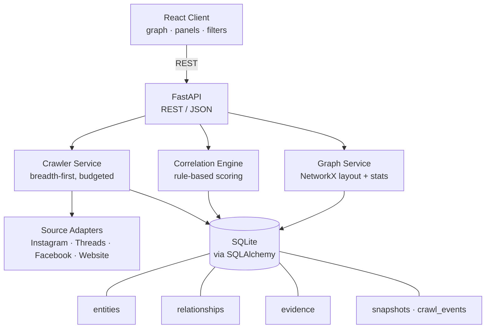
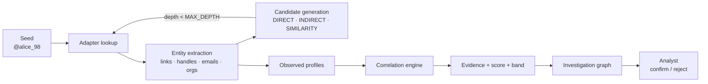
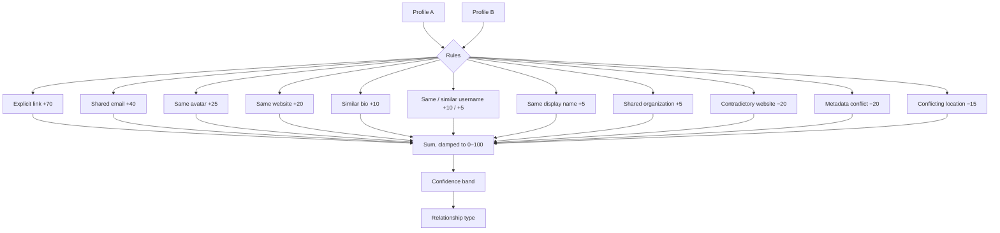
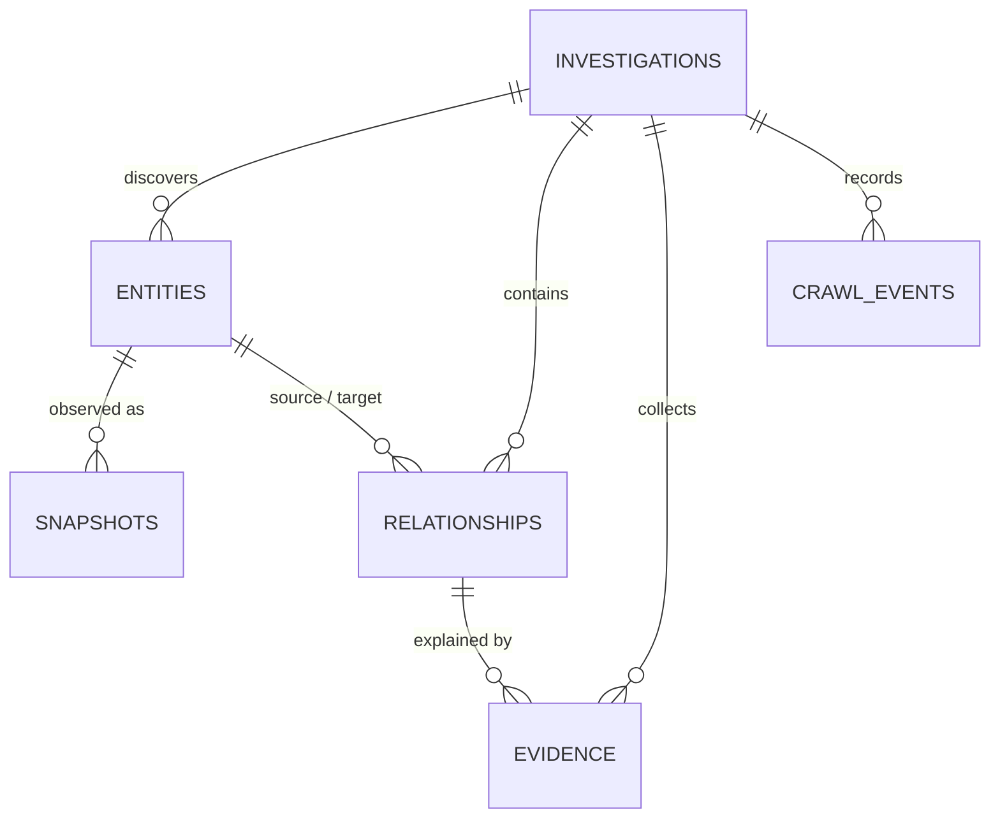
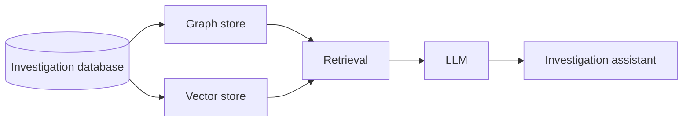

# Omnicient

> **Trace public identities. Follow the evidence.**

Omnicient is an **evidence-backed OSINT crawling and identity correlation
platform**. It starts from a single publicly observable identifier, discovers
other publicly observable entities and relationships, scores potential
associations with a transparent rule-based model, and presents the whole
investigation as an interactive graph an analyst can interrogate, confirm or
reject.

The central principle:

```
Don't claim the identity.
Show the evidence.
```

Omnicient never states that two accounts belong to the same person. It reports
*potential associations* — with the observations behind them, the points each
observation contributed, and the contradictions that argue against them.

---

## Table of contents

- [Problem statement](#problem-statement)
- [Features](#features)
- [Architecture](#architecture)
- [Technology stack](#technology-stack)
- [Installation](#installation)
- [Running the application](#running-the-application)
- [Environment variables](#environment-variables)
- [Demo mode](#demo-mode)
- [API documentation](#api-documentation)
- [Correlation methodology](#correlation-methodology)
- [Confidence scoring](#confidence-scoring)
- [Crawler behaviour and limitations](#crawler-behaviour-and-limitations)
- [Security protections](#security-protections)
- [Ethical and legal considerations](#ethical-and-legal-considerations)
- [Project structure](#project-structure)
- [Testing](#testing)
- [Working in a two-person team](#working-in-a-two-person-team)
- [Future architecture](#future-architecture)
- [License](#license)

---

## Problem statement

Given a known public account — say `Instagram: @alice_98` — an analyst wants to
know which other publicly observable entities are plausibly connected to it,
and *why*.

The usernames rarely match. The connection usually runs through something else:

```
Instagram @alice_98
        │ bio links to
        ▼
     alice.dev
      ╱   │   ╲
     ▼    ▼    ▼
 GitHub Threads Reddit
```

A username search engine answers "does this handle exist elsewhere?", which is
the wrong question — handles are reused by unrelated people all the time.
Omnicient answers a different one: **what publicly observable evidence connects
these entities, and how strong is it?**

That is why the pipeline is split into distinct stages, with the analyst — not
the tool — making the final call:

```
DISCOVERY → ENTITY EXTRACTION → CANDIDATE GENERATION
          → CORRELATION → EVIDENCE → INVESTIGATION GRAPH → ANALYST
```

---

## Features

**Investigation**

- Create an investigation from a username, `@handle` or profile URL
- Controlled breadth-first crawl of permitted public sources
- Entity extraction, candidate generation and correlation in one run
- Persisted timeline of every crawl event, including source failures
- Re-runnable discovery that preserves analyst decisions
- Full JSON export

**Evidence and correlation**

- Ten evidence types, including negative (contradictory) evidence
- Transparent additive scoring with configurable point values
- Four confidence bands, never presented as probabilities
- Every point traceable to an evidence row with the URL it came from
- "Insufficient evidence" is a first-class, common outcome

**Interface**

- Dark, dense investigation console
- Interactive React Flow graph with zoom, pan, drag, fit, reset layout
- Entity, relationship and evidence panels
- Filters for entity type, relationship type, confidence band and score
- Focus mode (expand/collapse an entity's connections)
- Analyst confirm / reject / undo workflow

**Sources**

- Instagram, Threads, Facebook and website adapters
- Platform-aware URL parsing for GitHub, Reddit, X, LinkedIn, YouTube and
  Mastodon — discovered as candidate entities before adapters exist for them
- Adapter interface designed so a new platform is one new class

---

## Architecture



The investigation pipeline:



**Separation of concerns.** The crawler *finds* information. The correlation
engine *evaluates* relationships. The graph service *shapes* them for display.
The frontend *renders* them. The analyst *decides*. The frontend never learns
how crawling works — it consumes entities, relationships, evidence and a graph.

---

## Technology stack

| Layer     | Choice                                                              |
| --------- | ------------------------------------------------------------------- |
| Backend   | Python 3.12+, FastAPI, Pydantic v2, SQLAlchemy 2, SQLite             |
| Crawling  | httpx (async), BeautifulSoup4, lxml                                  |
| Graph     | NetworkX (processing), React Flow (visualisation)                    |
| Frontend  | React 18, TypeScript, Vite, Tailwind CSS v4, `@xyflow/react`         |
| Testing   | pytest, pytest-asyncio, Ruff                                         |

No Kubernetes, Kafka, Redis, Celery, Neo4j, Elasticsearch or microservices.
The MVP is a single API process, a single SQLite file and a static frontend —
deliberately. The seams that would let those be introduced later are described
under [Future architecture](#future-architecture).

---

## Installation

Requirements: **Python 3.12+** and **Node.js 20+**.

```bash
git clone <repository>
cd omnicient
```

### Backend

```bash
cd backend
python -m venv .venv
source .venv/bin/activate          # Windows: .venv\Scripts\activate
pip install -r requirements.txt
cp .env.example .env               # optional: every value has a default
```

### Frontend

```bash
cd frontend
npm install
```

---

## Running the application

Two terminals:

```bash
# Terminal 1 — API on http://127.0.0.1:8000
cd backend
source .venv/bin/activate
uvicorn app.main:app --reload
```

```bash
# Terminal 2 — interface on http://localhost:5173
cd frontend
npm run dev
```

Open <http://localhost:5173>, enter `@alice_98`, and press **Start
investigation**. Demo mode is on by default, so this works with no network
access and no credentials of any kind.

**Database setup is automatic.** The SQLite file and its parent directory are
created on startup and the schema is applied with `create_all`. No migration
step, no manual SQL.

### Docker

```bash
docker compose up --build
# interface: http://localhost:5173
# API docs:  http://localhost:8000/docs
```

---

## Environment variables

All are optional; see `backend/.env.example`.

| Variable                            | Default                      | Purpose                                                |
| ----------------------------------- | ---------------------------- | ------------------------------------------------------ |
| `OMNICIENT_DATABASE_URL`            | `sqlite:///./data/omnicient.db` | SQLAlchemy database URL                            |
| `OMNICIENT_DEMO_MODE`               | `true`                       | Use the offline synthetic dataset                      |
| `OMNICIENT_MAX_DEPTH`               | `2`                          | Maximum crawl depth from the seed                      |
| `OMNICIENT_MAX_PAGES`               | `50`                         | Page budget for one investigation                      |
| `OMNICIENT_REQUEST_TIMEOUT`         | `10`                         | Per-request timeout, seconds                           |
| `OMNICIENT_REQUEST_DELAY`           | `1.0`                        | Minimum delay between requests to one host             |
| `OMNICIENT_MAX_RESPONSE_BYTES`      | `2000000`                    | Response size limit                                    |
| `OMNICIENT_MAX_REDIRECTS`           | `3`                          | Redirect hops, each re-validated                       |
| `OMNICIENT_RESPECT_ROBOTS`          | `true`                       | Honour `robots.txt` where available                    |
| `OMNICIENT_ALLOW_PRIVATE_NETWORKS`  | `false`                      | **Disables the SSRF guard.** Isolated test networks only |
| `OMNICIENT_USER_AGENT`              | `Omnicient/0.1 …`            | Identifying User-Agent                                 |
| `OMNICIENT_CORS_ORIGINS`            | `http://localhost:5173,…`    | Allowed browser origins                                |
| `OMNICIENT_LOG_LEVEL`               | `INFO`                       | Log level                                              |

---

## Demo mode

Demo mode is mandatory to the design: Omnicient must demonstrate the entire
pipeline without contacting any external service. It ships a synthetic dataset
built to exercise every class of evidence.

| Entity                        | Role in the demonstration                                   |
| ----------------------------- | ----------------------------------------------------------- |
| Instagram `@alice_98`         | Seed; links to Threads, the website, and a private profile   |
| Threads `@alice_dev`          | Explicitly linked — strongest possible evidence              |
| Website `alice.dev`           | The pivot: links to GitHub, Reddit, Threads, Instagram, Facebook |
| GitHub `@alice-security`      | Same avatar, same website, similar bio → **HIGH**            |
| Reddit `@alice_security`      | Shares the website only → **MEDIUM**                         |
| Facebook `Alice Example`      | Shares the website and display name → **MEDIUM**             |
| Facebook `alice.private`      | Cannot be read publicly → demonstrates graceful failure      |
| X `@alice98`                  | Similar handle, **different website, conflicting location** → contradictory |
| `alice@alice.dev`, `Contoso Labs` | Email and organization pivots                           |

Everything in it is fictional and every entity carries a **`DEMO DATA`** badge
in the interface and a `notice` field in the API. It describes no real person.

Switching demo mode off (per investigation, or with `OMNICIENT_DEMO_MODE=false`)
makes the same pipeline query live public pages. Platforms that require a login
are reported as unavailable rather than worked around.

---

## API documentation

FastAPI publishes interactive OpenAPI docs at <http://localhost:8000/docs>.

| Method   | Path                                        | Purpose                                  |
| -------- | ------------------------------------------- | ---------------------------------------- |
| `GET`    | `/api/health`                               | Status, mode, sources, confidence bands  |
| `POST`   | `/api/investigations`                       | Create (and by default start) one        |
| `GET`    | `/api/investigations`                       | List, newest first                       |
| `GET`    | `/api/investigations/{id}`                  | Detail with timeline and source issues   |
| `DELETE` | `/api/investigations/{id}`                  | Delete an investigation and its data     |
| `POST`   | `/api/investigations/{id}/crawl`            | Run discovery + correlation synchronously |
| `GET`    | `/api/investigations/{id}/entities`         | Entities (optional `?type=`)             |
| `GET`    | `/api/investigations/{id}/relationships`    | Relationships (optional `?min_score=`)   |
| `GET`    | `/api/investigations/{id}/graph`            | Nodes, edges, layout hints, statistics   |
| `GET`    | `/api/investigations/{id}/events`           | Crawl timeline                           |
| `GET`    | `/api/investigations/{id}/evidence`         | All evidence for the investigation       |
| `GET`    | `/api/investigations/{id}/export`           | Full JSON export (`?download=true`)      |
| `GET`    | `/api/entities/{id}`                        | Entity with snapshot history             |
| `GET`    | `/api/entities/{id}/relationships`          | Relationships touching an entity         |
| `GET`    | `/api/relationships/{id}`                   | Relationship with endpoints and evidence |
| `GET`    | `/api/relationships/{id}/evidence`          | Evidence split into support / contradiction |
| `POST`   | `/api/relationships/{id}/confirm`           | Analyst: evidence reviewed and supportive |
| `POST`   | `/api/relationships/{id}/reject`            | Analyst: false positive                  |
| `POST`   | `/api/relationships/{id}/reset`             | Analyst: undo a decision                 |

### The contract between backend and frontend

The backend hands over an investigation graph; the frontend renders it:

```json
{
  "nodes": [{ "id": "…", "type": "ACCOUNT", "platform": "github", "position": { "x": 0, "y": 220 } }],
  "edges": [{ "id": "…", "source": "…", "target": "…", "confidence_score": 65, "evidence_count": 5 }],
  "stats": { "entities": 11, "relationships": 22, "evidence": 45, "contradictions": 2 }
}
```

---

## Correlation methodology

Correlation runs over the *observed profiles* the crawler collected — never
over raw HTML — and compares every pair of account entities. Each rule that
fires produces one evidence row: a type, a human-readable description, the
value it extracted, the URL it came from, and its point contribution.



Design decisions worth knowing:

- **Positive evidence is required.** A pair that only contradicts each other is
  not a relationship and gets no edge; contradictions instead weaken the
  relationships they actually touch.
- **Structural edges are separate.** `LINKS_TO` / `REFERENCES` edges record an
  observed public link (A's bio links to B). Correlation edges
  (`POTENTIAL_SAME_IDENTITY`, `SHARED_WEBSITE`, …) record an inference *about*
  identity. Both can exist between the same pair, and they mean different things.
- **Provenance is preserved.** Every entity records whether it was reached by an
  explicit link (`DIRECT`), through another entity (`INDIRECT`), or generated
  from a handle variant (`SIMILARITY`). A similarity candidate earns nothing by
  existing.
- **Weak signals are labelled weak.** Evidence text for username and display
  name matches says so explicitly, in the analyst's own words, not just numerically.
- **Avatar matching compares normalized image URLs** in the MVP — it catches one
  image reused across platforms, not a re-encoded copy. Perceptual hashing is
  the obvious next step and slots into the same evidence type.

All point values live in one place, `ScoringConfig` in `backend/app/config.py`.

---

## Confidence scoring

| Score    | Band          |
| -------- | ------------- |
| 0–19     | `LOW`         |
| 20–49    | `MEDIUM`      |
| 50–74    | `HIGH`        |
| 75–100   | `VERY HIGH`   |
| no evidence | `INSUFFICIENT` |

**These are not probabilities.** A score of 72 means "the evidence found adds
up to 72 points under the current model" — not "72% likely to be the same
person". The interface always shows the band, the score and the reasons
together, for example:

```
Instagram @alice_98  ↕  GitHub @alice-security
Potential Same Identity · Confidence HIGH · Score 65

Supporting evidence
  ✓ SAME_AVATAR          +25  Both profiles use the same public avatar image
  ✓ SAME_WEBSITE         +20  Both profiles publish the same external website: alice.dev
  ✓ SIMILAR_BIO          +10  Public biographies use substantially the same wording
  ✓ SAME_DISPLAY_NAME     +5  Same public display name ('Alice R.') — weak, many people share a name
  ✓ SHARED_ORGANIZATION   +5  Both profiles reference the organization 'contoso labs'

Contradictions
  None

Analyst status: UNREVIEWED   [Confirm] [Reject]
```

`CONFIRMED` means **an analyst reviewed the evidence and judged it supportive**.
It never asserts real-world identity certainty, and the wording in the UI, the
API and the export all say so.

---

## Crawler behaviour and limitations

The crawler is breadth-first and bounded in every direction: depth
(`MAX_DEPTH=2`), pages (`MAX_PAGES=50`), per-request timeout, response size,
redirect hops, and a polite per-host delay. It follows only URLs discovered
during the investigation, de-duplicates entities by `(type, platform,
identifier)`, and honours `robots.txt` where it is available.

### Instagram, Threads and Facebook cannot be crawled live

This is worth stating up front, because it is the first thing you will hit.
All three publish the same rule:

```
# instagram.com/robots.txt, facebook.com/robots.txt, threads.com/robots.txt
User-agent: *
Disallow: /
```

Omnicient honours `robots.txt`, so a live investigation seeded with an
Instagram handle stops immediately with:

```
instagram:<handle> could not be read: robots.txt at https://instagram.com disallows this path
```

That is the tool working as designed, not a failure. The options are:

1. **Demo mode** (the default) — the full pipeline, offline, on synthetic data.
2. **Seed a website instead** — `platform: website`, e.g. `alice.dev`. Personal
   sites usually permit crawling, and a personal site is the strongest pivot in
   a public-source investigation anyway: it is where people list their own
   accounts. This path works live today and yields GitHub, Reddit, X, LinkedIn,
   Mastodon and Threads accounts, emails and organizations.
3. `OMNICIENT_RESPECT_ROBOTS=false` — the operator's call, and their
   responsibility. Note that it changes little in practice: Meta platforms serve
   logged-out clients a login wall, which Omnicient reports as `PRIVATE` or
   `BLOCKED` and does not work around. Their terms of service separately
   prohibit automated collection.

**Other known limitations, stated plainly:**

- Only the first page of a website is fetched, and only links to *other* hosts
  become new entities — a site's own internal pages are not identities.
- GitHub, Reddit, X, LinkedIn, YouTube and Mastodon are *recognised* (their
  URLs parse into platform + identifier) but have no adapter yet, so they
  appear as unresolved candidate entities in live mode.
- Avatar comparison is URL-based (see above).
- Organization extraction is conservative and worth few points by design.
- A failing source never fails an investigation: the reason is recorded in the
  timeline, surfaced in the sidebar, and the run completes with what it has.

---

## Security protections

Omnicient fetches URLs found inside untrusted content, which makes the crawler
a request-forgery primitive unless it is constrained. It is constrained:

- **SSRF guard** on the initial URL *and every redirect hop*: only `http(s)`,
  no embedded credentials, and hostnames rejected when they are `localhost`,
  `*.local` / `*.internal`, or resolve to loopback, RFC1918, link-local,
  multicast, reserved or cloud-metadata addresses (`169.254.169.254` and
  friends). Every address a hostname resolves to is checked, not just the first.
- **Response size limits** enforced while streaming, so an oversized body is
  abandoned rather than buffered.
- **Timeouts, redirect caps, depth caps and page budgets** on every crawl.
- **Input validation** on seed identifiers and platform names before anything
  is queried.
- **Safe HTML parsing** with lxml through BeautifulSoup; parse failures become
  structured errors instead of exceptions.
- **Structured logging** with automatic redaction of any field whose name looks
  like a credential. Omnicient handles no passwords, tokens, cookies or
  sessions at all.
- **Foreign keys enforced** in SQLite, with cascade deletes.

Tests cover the SSRF guard, the redirect re-validation path and the size limit.

---

## Ethical and legal considerations

Omnicient is intended for:

- authorized OSINT
- cybersecurity research
- academic research
- threat intelligence
- defensive investigations
- digital footprint analysis

Omnicient **does not and will not** implement authentication or authentication
bypass, private-account access, credential harvesting, CAPTCHA bypass,
rate-limit evasion, cookie or session reuse, session hijacking, unauthorized
API access, private-information extraction, or unrestricted mass scraping.
These are not missing features; excluding them is a design commitment.

The tool reports *potential associations* from public data. Attributing a
digital identity to a real person is a consequential act with real
consequences for that person. Omnicient deliberately stops short of it, shows
its evidence, and leaves the judgement — and the responsibility — with the
analyst. Users are responsible for complying with applicable law, platform
terms and data-protection regulation.

---

## Project structure

```
omnicient/
├── backend/
│   ├── app/
│   │   ├── main.py             FastAPI application, CORS, error handlers
│   │   ├── config.py           Settings + ScoringConfig (all point values)
│   │   ├── database.py         Engine, session factory, schema creation
│   │   ├── demo_data.py        Synthetic dataset and offline adapters
│   │   ├── api/                health, investigations, entities,
│   │   │                       relationships, evidence
│   │   ├── models/             SQLAlchemy tables + shared enums
│   │   ├── schemas/            Pydantic request/response contract
│   │   ├── services/           crawler, discovery, correlation, graph,
│   │   │                       investigation (orchestration)
│   │   ├── sources/            base + instagram, threads, facebook, website
│   │   └── utils/              normalization, url_parser, validation, logging
│   ├── tests/                  normalization, url_parser, correlation,
│   │                           graph, sources, api
│   ├── requirements.txt
│   └── .env.example
├── frontend/
│   ├── src/
│   │   ├── components/         InvestigationGraph, EntityNode, EntityPanel,
│   │   │                       RelationshipPanel, EvidencePanel, Sidebar,
│   │   │                       Filters, SearchBar, InvestigationHeader
│   │   ├── pages/              Dashboard, Investigation
│   │   ├── api/client.ts       Typed REST client
│   │   ├── types/index.ts      The API contract in TypeScript
│   │   └── lib/display.ts      Shared presentation vocabulary
│   ├── package.json
│   └── vite.config.ts
├── docker-compose.yml
├── README.md
└── LICENSE
```

### Data model



Entity types: `ACCOUNT`, `WEBSITE`, `DOMAIN`, `USERNAME`, `EMAIL`, `PERSON`,
`ORGANIZATION`. Relationship types: `LINKS_TO`, `REFERENCES`, `USES_USERNAME`,
`SHARED_WEBSITE`, `SHARED_EMAIL`, `SHARED_AVATAR`, `SHARED_ATTRIBUTE`,
`POTENTIAL_SAME_IDENTITY`, `CONTRADICTORY`. Evidence types: `EXPLICIT_LINK`,
`SAME_WEBSITE`, `SAME_USERNAME`, `SIMILAR_USERNAME`, `SAME_DISPLAY_NAME`,
`SAME_AVATAR`, `SIMILAR_BIO`, `SHARED_EMAIL`, `SHARED_ORGANIZATION`,
`CONTRADICTORY_ATTRIBUTE`.

A **snapshot** is written every time an entity is observed. The MVP only stores
them; keeping the history from day one is what makes temporal analysis
possible later without a migration.

---

## Testing

```bash
cd backend
source .venv/bin/activate
pytest              # 110 tests
ruff check .        # lint
```

```bash
cd frontend
npm run typecheck
npm run build
```

The suite covers normalization (handles, URLs, domains, platforms,
similarity), URL parsing across nine platforms plus the SSRF guard, every
correlation rule including contradictions and the no-evidence case, entity and
relationship de-duplication, evidence attachment, snapshot writing, graph
layout determinism, and the full API contract — creation, crawling, graph
retrieval, evidence, confirm/reject and export. Tests run entirely offline.

---

## Working in a two-person team

The API contract is the seam, so the two halves can be built independently.

| Developer 1 — OSINT / backend                            | Developer 2 — interface                                   |
| -------------------------------------------------------- | --------------------------------------------------------- |
| `app/sources/`, `services/crawler.py`, `discovery.py`     | `frontend/src/components/`, `pages/`                       |
| `services/correlation.py`, `utils/normalization.py`       | React Flow graph, entity/relationship/evidence panels       |
| `models/`, `database.py`, `api/`, backend tests           | filters, analyst workflow, dashboard                        |
| *Owns: discovery, extraction, correlation, evidence*      | *Owns: investigation interface and analyst experience*      |

The frontend never needs to know how crawling works: it receives
`{ entities, relationships, evidence }` and a laid-out graph. `frontend/src/types/index.ts`
mirrors the backend schemas and is the document both sides agree on.

---

## Future architecture

None of the following is implemented — the MVP is deliberately small — but the
code is shaped so each can be added without a rewrite.

**More sources.** A new platform is one class:

```python
class GitHubAdapter(SourceAdapter):
    platform = "github"

    async def lookup(self, identifier: str) -> LookupResult:
        ...
```

Register it in `ADAPTER_CLASSES` and the crawler, correlation engine and API
are untouched. URL parsing for GitHub, Reddit, X, LinkedIn, YouTube and
Mastodon already exists, so those entities are discovered today and simply
become resolvable when an adapter appears.

**Retrieval-augmented investigation assistant.**



The evidence model is already flat, self-describing and individually
addressable — each row carries its type, description, extracted value, source
URL and timestamp — which is exactly what a retrieval layer needs to answer
"why are these two accounts connected?" or "what changed since the first
observation?". An assistant would **retrieve and summarise stored evidence**;
it must never independently determine identity.

**Machine learning.** `CorrelationEngine` is isolated behind a small interface
and its weights live in a configuration object, so rule-based scoring can be
replaced by probabilistic entity resolution or a learned ranker while the
evidence model, API and interface stay as they are. Confirmed and rejected
relationships accumulate as labelled training data from day one.

**Scale.** SQLite and in-process services are the MVP's deliberate choice. The
seams for growth are already there: swap the SQLAlchemy URL for PostgreSQL,
move `InvestigationService.run` behind a task queue, and mirror the graph into
a graph store — none of which changes the REST contract the frontend depends on.

**Export formats.** JSON export is implemented. The export bundle is
intentionally flat so CSV, HTML/PDF reporting and STIX can be generated from
it without re-querying.

---

## License

MIT — see [LICENSE](LICENSE), which also states the intended-use restrictions.

---

<div align="center">

**Omnicient** — *Don't claim the identity. Show the evidence.*

</div>
